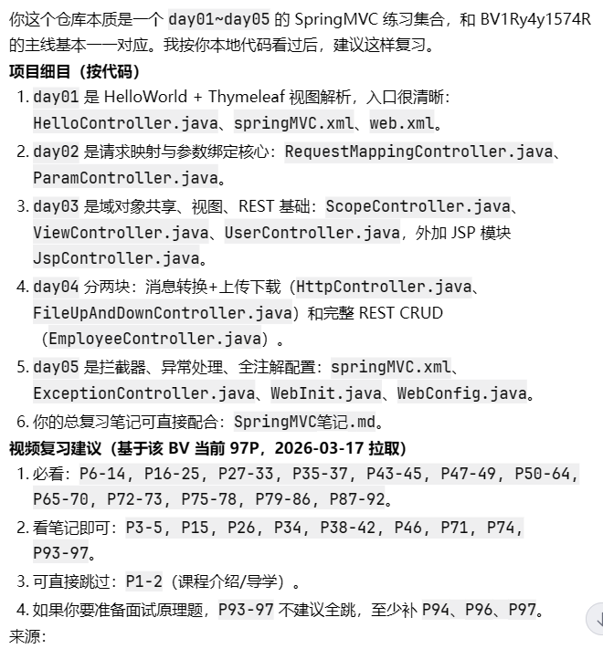

# 一、这份笔记的目标

这份笔记不是完整 Spring6 教程，而是给你当前项目（`day01~day05`）准备的“最小前置”。

目标只有两个：

1. 看 SpringMVC 代码时，知道 Spring 核心在干什么。
2. 能把 `Spring6课程里的IoC/注解装配` 快速迁移到这个项目里。

# 二、进入SpringMVC前必须会的Spring核心

### 1、IoC 和 DI（核心中的核心）

- IoC（控制反转）本质：对象创建权和对象依赖关系维护权，从业务代码交给容器。
- DI（依赖注入）本质：容器在创建对象时，把其依赖注入进去。
- 在代码里最直接的体现：你不 `new` Service/Dao，而是通过容器拿 Bean。

你可以用一句话记住：

> IoC 是思想，DI 是实现方式。

### 2、IoC容器：ApplicationContext

- Spring 实际开发中主要使用 `ApplicationContext`（不是直接用 `BeanFactory`）。
- 常见实现：
1. `ClassPathXmlApplicationContext`：读类路径下 XML 配置。
2. `WebApplicationContext`：Web 环境下的容器（SpringMVC 就是这个体系）。

### 3、Bean如何放进容器

两条路都要认识，因为你项目里两种都用了。

1. XML方式：
   在 XML 里声明 `<bean>`、`<context:component-scan>`。
2. 注解方式：
   `@Component/@Controller/@Service/@Repository + @ComponentScan + @Configuration`。

你项目里的对应点：

- `day01~day05(springMVC-demo5)` 主要是 XML 扫描。
- `day05/springMVC-annotation` 是全注解配置。

### 4、自动装配规则（重点）

- `@Autowired` 默认按类型注入（byType）。
- 如果同类型 Bean 不唯一，需要 `@Qualifier("beanName")` 指定名称。
- 只有一个有参构造器时，构造器上的 `@Autowired` 可以省略（Spring6课件里有明确演示）。

对你这个项目的意义：

- 当前示例大多是单实现，`@Autowired` 直接可用。
- 后续你自己扩展多个实现类时，第一时间想到 `@Qualifier`。

### 5、分层注解与职责

1. `@Controller`：控制层，接收请求，调业务，返回视图/响应体。
2. `@Service`：业务层，写业务组合逻辑。
3. `@Repository`：数据访问层。
4. `@Component`：通用组件。

注意：这四个注解在“注册Bean”能力上等价，区别主要是语义和分层可读性。

### 6、Bean作用域和生命周期（够用版）

- 默认作用域：`singleton`（单例）。
- Web 项目里绝大多数 Controller/Service 都是单例，避免在成员变量里放请求级临时数据。

# 三、Spring到SpringMVC的衔接点

### 1、Web容器 + Spring容器 + DispatcherServlet

SpringMVC 本质是：

1. Tomcat 启动 Web 应用。
2. 创建 Spring Web 容器。
3. 由 `DispatcherServlet` 统一接收请求并分发给 Controller。

你项目里的入口位置：

1. XML版入口：`src/main/webapp/WEB-INF/web.xml`
2. 全注解版入口：`day05/springMVC-annotation/.../WebInit.java`

### 2、为什么要配组件扫描

不扫描就不会把 Controller/Interceptor 等类放进容器，`@RequestMapping` 也就不会生效。

你项目里体现：

1. XML版：`<context:component-scan base-package="...">`
2. 注解版：`@ComponentScan("...")`

### 3、Filter和SpringMVC的边界

你项目常见两个 Filter：

1. `CharacterEncodingFilter`：解决编码问题。
2. `HiddenHttpMethodFilter`：让表单支持 PUT/DELETE 语义。

理解顺序：请求先过 Filter，再进 `DispatcherServlet`，再由 SpringMVC 匹配处理器。

# 四、和当前项目的逐日衔接

### Day01（HelloWorld）

你要会的 Spring 前置：

1. IoC容器是什么。
2. 组件扫描如何注册 Controller。

你要看懂的代码：

1. `HelloController` 为什么不用自己实例化。
2. `springMVC.xml` 里视图解析器怎么把逻辑视图名解析到模板。

### Day02（请求映射 + 参数绑定）

你要会的 Spring 前置：

1. `@Controller` 是容器里的 Bean。
2. `@Autowired` 基本规则（虽然这天用得不重，但要建立心智）。

你要看懂的代码：

1. `@RequestMapping` 各属性映射逻辑。
2. `@RequestParam/@RequestHeader/@CookieValue` 参数绑定。

### Day03（域数据、视图、REST基础）

你要会的 Spring 前置：

1. MVC 中“模型数据”不是成员变量共享，而是请求级传递。
2. 单例 Controller 线程安全意识。

你要看懂的代码：

1. `ModelAndView / Model / Map / ModelMap` 的使用。
2. 转发和重定向。
3. REST 风格 URL + HiddenHttpMethodFilter。

### Day04（消息转换 + 文件上传下载 + REST案例）

你要会的 Spring 前置：

1. Bean 注册和依赖注入（Controller、Dao 都在容器内）。
2. Web请求处理链路。

你要看懂的代码：

1. `@RequestBody / @ResponseBody / RequestEntity / ResponseEntity`
2. `multipartResolver` 与 `MultipartFile`
3. `springMVC-rest` 的 CRUD 流程（Controller + Dao + 页面）

### Day05（拦截器、异常处理、全注解配置）

你要会的 Spring 前置：

1. 注解配置类：`@Configuration + @Bean`
2. 组件扫描与容器启动流程

你要看懂的代码：

1. `HandlerInterceptor` 三个方法和执行顺序
2. `@ControllerAdvice + @ExceptionHandler`
3. `WebInit/WebConfig/SpringConfig` 如何替代 `web.xml + springMVC.xml`

# 五、你现在就能用的最小复习清单

### 1、先补Spring（只补必要）

1. IoC/DI 概念。
2. `@ComponentScan`。
3. `@Controller/@Service/@Repository/@Component`。
4. `@Autowired + @Qualifier`。
5. `@Configuration + @Bean`。

### 2、再看SpringMVC项目（按这个顺序）

1. `day01 -> day02 -> day03 -> day04 -> day05`
2. 每天结束时回答三个问题：
   这个请求由谁接收？
   这个Bean由谁创建？
   数据是放在哪个作用域传递的？

# 六、易混点（结合你仓库）

### 1、Spring5/6 与 javax/jakarta 差异

- 你的 `day01` 用 `Spring6 + jakarta.servlet`。
- 其余多数模块是 `Spring5 + javax.servlet`。

这属于版本差异，不是你概念错了。复习时先抓机制，不要先纠结包名。

### 2、为什么“会Spring”后看SpringMVC会快很多

因为 SpringMVC 的 Controller、拦截器、异常处理器，本质上都是 Spring 容器管理的 Bean。  
你把 IoC/DI 打牢，SpringMVC 就只是“Web场景下的 Spring 应用”。
